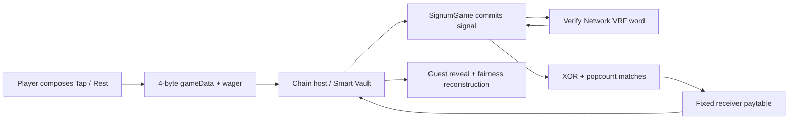

# Signum launch kit

## One sentence

Compose a complete Tap/Rest rhythm, commit it with your wager, then hear Chain's independently generated VRF echo answer beat by beat—the number of positional matches selects a transparent payout.

## 100-word pitch

Signum: Resonance is a provably fair casino original built around audiovisual call and response. Choose a four-, six-, or eight-beat receiver, compose any Tap/Rest signal, and commit it with one wager. Chain's VRF then creates an independent ghost signal. Signum reveals both phrases beat by beat, counts positional matches, and settles against one of three transparent binomial paytables with 96.09–96.25% RTP. Every authored pattern has identical odds, so creativity never becomes a misleading strategy claim. A standalone no-funds demo, exact fairness reconstruction, local non-predictive journal, synthesized sound, keyboard support, and mobile-first production build make the whole loop immediately playable and inspectable.

## Submission pitch / info

Signum turns one transparent mathematical rule into an expressive casino instrument: write a binary rhythm, send it, and listen as Chain answers. It is not Dice, Keno, a multi-coin parlay, or a signal-search game. The player fills every ordered position; VRF fills an independent equal-length signal; Hamming similarity selects a graded payout. Pulse (4 beats, 96.25%, 7.40x), Carrier (6 beats, 96.09375%, 21.50x), and Deepwave (8 beats, 96.09375%, 40.00x) provide distinct volatility without changing the core interaction. The exact XOR/popcount settlement is reconstructed in the fairness panel, and all 69,888 player/ghost combinations are checked in both TypeScript and Solidity.

- Live URL: <https://ecstaceelor.github.io/Signum/>
- Judge showcase: <https://ecstaceelor.github.io/Signum/?showcase=1>
- Source: <https://github.com/EcstaceeLOR/Signum>
- Declared RTP: `96.25% Pulse; 96.09375% Carrier and Deepwave`

## Architecture and fairness



The guest never owns wallet signing or outcome generation. The contract commits the complete signal before requesting randomness, derives the ghost bits from the verified word, and returns a settled six-byte state. The UI independently decodes that state and shows the player/ghost signals, match count, payout math, transaction identifiers, and browser VRF-verification verdict.

## Final-build media

- `docs/assets/signum-pulse.png`
- `docs/assets/signum-carrier.png`
- `docs/assets/signum-deepwave.png`
- `docs/assets/signum-showcase-demo.webm`
- `public/og-image.png` (1200 × 630 gallery still)

The stills and video are captured from the visibly labelled `?showcase=1` standalone fixture. Its perfect echo is deterministic for reproducible media and is **not** represented as Chain or VRF settlement. The real Chain/VRF lifecycle is separately proven by `npm run test:e2e:simulator` and must be used if a final submission edit specifically requests on-chain footage.

Regenerate the assets with:

```bash
node scripts/capture-launch-assets.mjs
```
